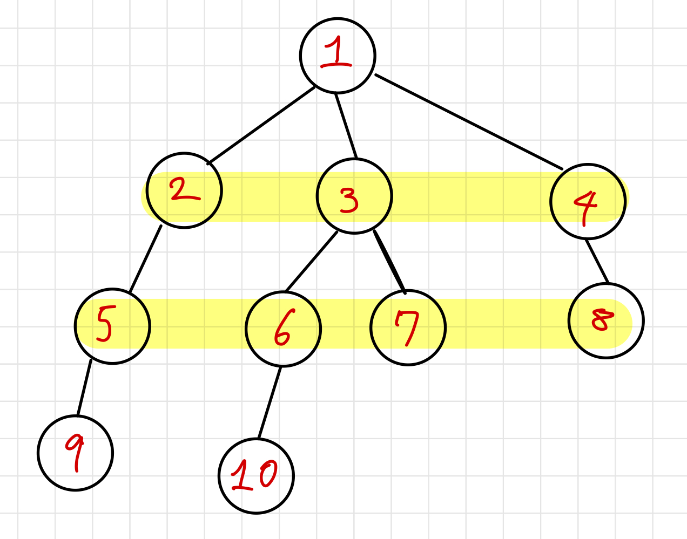
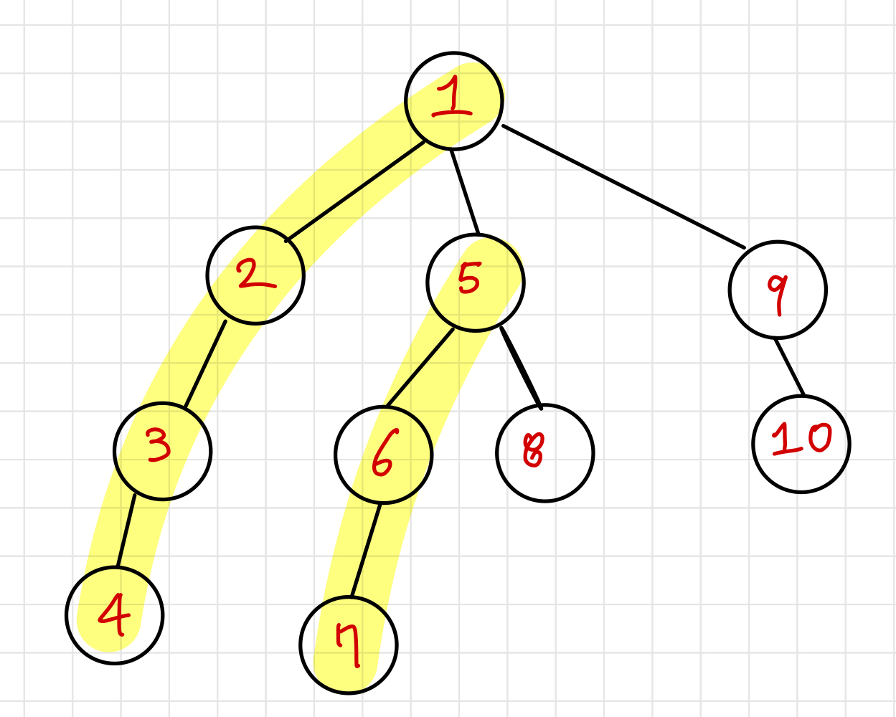

# BFS

> Breadth First Search (너비 우선 탐색)

</img>

시작점인 root 노드와 같은 거리에 있는 노드를 우선으로 방문

큐(Queue)를 사용해 노드를 방문하면서 인접한 노드 중 방문하지 않았던 노드의 정보를 큐에 넣어 먼저 큐에 들어있던 노드를 방문

but 큐를 사용하지 않아도 구현이 가능하긴함

1. 탐색 시작 노드를 큐에 삽입하고 방문 처리
2. 큐에서 노드르 꺼내 해당 노드의 방문하지 않은 모든 인접 노드를 모두 큐에 삽입하고 방문 처리
3. 2번 과정을 더 이상 수행할 수 없을 때까지 반복

```
def BFS(start_node):

    	# queue 에 첫 번째 노드 넣으면서 시작
        queue = [start_node, ]

        while True:
            # queue가 비어있는지 확인
            if len(queue) == 0:
            	print('All node searched.')
                return None

            # queue에서 맨 앞의 노드 를 dequeue (0번 인덱스를 pop)
            node = queue.pop(0)

            # 만약 node가 찾고자 하는 target이라면 서치 중단
            if node == TARGET:
            	print('The target found.')
                return node

            # node의 자식을 expand 해서 children에 저장
            children = expand(node)

            # children을 stack에 쌓기
            queue.extend(children)

            # 이렇게 target을 찾거나, 전부 탐색해서 queue가 빌 때까지 while문 반복
```

# DFS

> Depth First Search (깊이 우선 탐색)

</img>

시작점인 root에서 갈 수 있는 한 끝까지 탐색해 leaf 노드를 방문하고 이전에 방문하지 않았던 노드를 선택해 방문

재귀함수 또는 스택(Stack)을 사용해 구현

1. 탐색 시작 노드를 스택에 삽입해서 방문 처리 (이미 방문했던 노드를 다시 방문하지 않기 위해)
2. 스택의 최상단 노드에 방문하지 않은 인접 노드가 있다면 그 노드를 스택에 껴넣고 방문 처리, 만약 방문하지 않은 인접 노드가 없다면 스택에서 최상단 노드를 꺼냄
3. 2번의 과정을 더 이상 수행할 수 없을 때까지 반복

```
def DFS(start_node):

    # stack에 첫 번째 노드를 넣으면서 시작
    stack = [start_node,]

    while True:
        # stack이 비어있는지 확인
        if len(stack) == 0:
            print("All node searched")
            return None

        # stack에서 맨 위의 노드를 pop
        node = stack.pop()

        # 만약 노드가 찾고자 하는 target이라면 search 중단
        if node == TARGET:
            print("The target found")
            return node

        # 노드의 자식을 expend 해서 children에 저장
        children = expend(node)

        # children을 stack에 쌓기
        stack.extend(children)

        # 이렇게 target을 찾거나 전부 탐색해 stack이 빌 때까지 while문 반복
```
