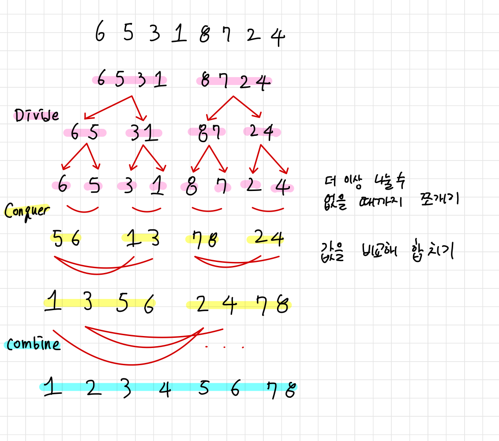

# Merge Sort

> 병합 정렬, O(logN)

</img>

분할 정복(Devide and Conquer) 기법과 재귀 알고리즘을 이용

1. 예제에서는 8->4->2->1 식으로 반복의 수는 점점 절반으로 줄어든다. O(logN)
2. 각 패스에서 병합할 때 모든 값을 비교해야한다. O(N)
3. 따라서 총 시간 복잡도는 O(NlogN)

주어진 배열을 원소가 하나 밖에 남지 않을 때까지 계속 둘로 쪼갠 후에 다시 크기 순으로 재배열 하면서 원래 크기의 배열로 합친다.

```
unsorted_list = [10-i for i in range(10)]

def mergeSort(unsorted_list):
    // list의 길이가 1보다 작으면 그대로 return
    if len(unsorted_list)<=1:
        return unsorted_list

    // 가장 짧아질 때까지 계속 반으로 나눔
    mid=len(unsorted_list)//2
    left=MergeSort(unsorted_list[:mid])
    right=MergeSort(unsorted_list[mid:])

    return Merge(left, right)

def merge(left, right):
    result = []
    while len(left) > 0 or len(right) > 0:
        if len(left) > 0 and len(right) > 0:
            if left[0] <= right[0]:
                result.append(left[0])
                left = left[1:]
            else:
                result.append(right[0])
                right = right[1:]
        elif len(left) > 0:
            result.append(left[0])
            left = left[1:]
        elif len(right) > 0:
            result.append(right[0])
            right = right[1:]
    return result


print(unsorted_list)
print(mergeSort(unsorted_list))
```
