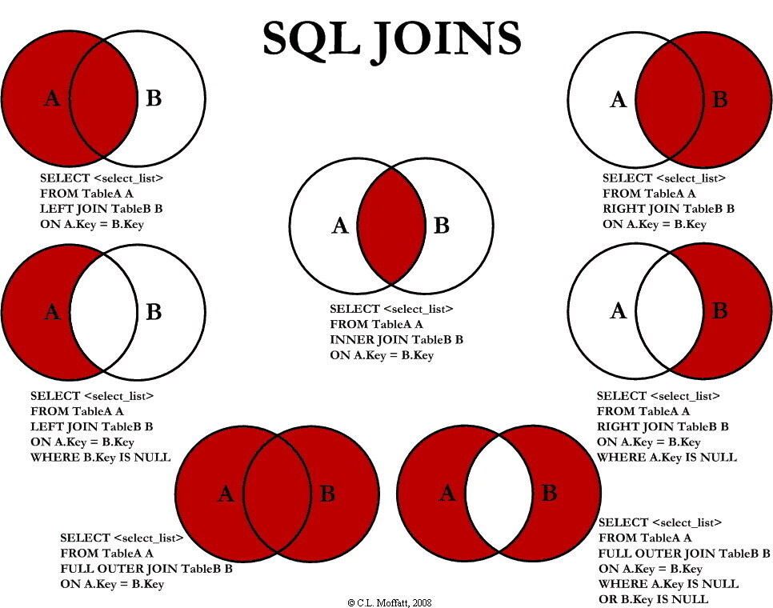
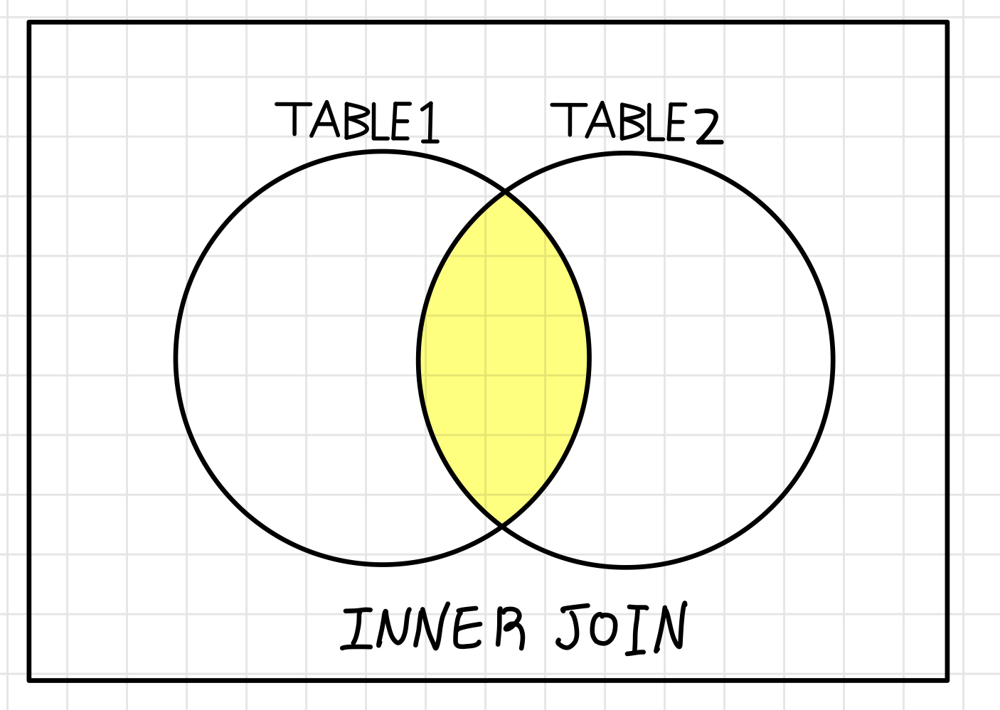
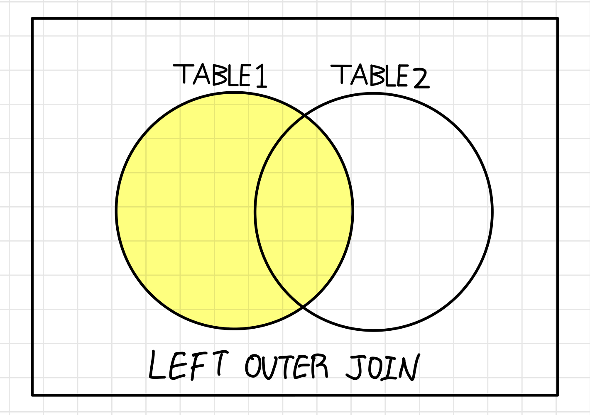
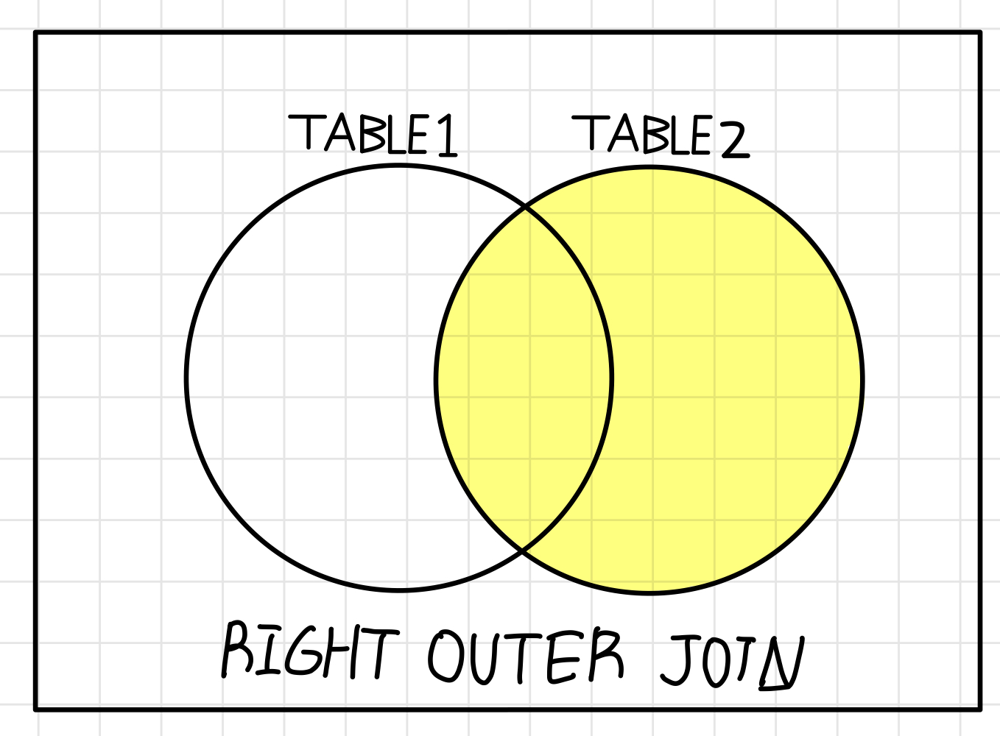
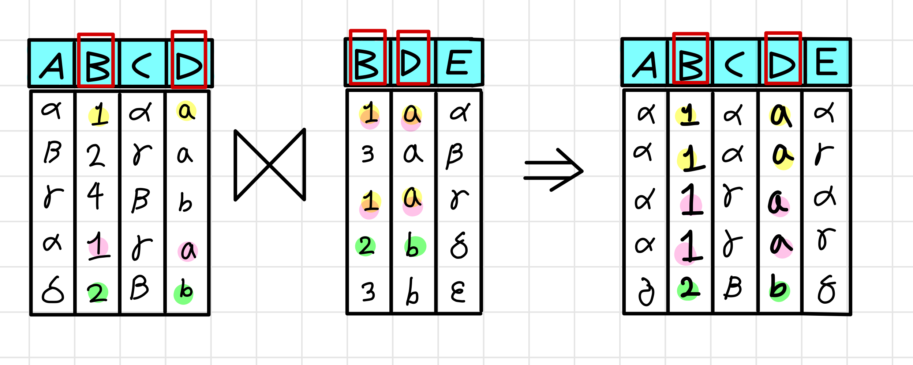

## JOIN

<center>
</img>
</center>

### JOIN을 크게 구별하는 두가지 방법!

> `JOIN` 조건으로 사용되는 연산자에 따른 분류

- `EQUI JOIN` : 두 테이블 간의 칼럼 값들이 서로 일치하는 경우, `JOIN` 조건으로 '=' 연산자 사용

```
아래 두가지 모두 EQUI JOIN

SELECT 칼럼_이름 FROM 테이블1, 테이블2
WHERE 테이블1.칼럼_이름 = 테이블2.칼럼_이름;

SELECT * FROM 테이블1 JOIN 테이블2 [ON 조인 조건에 따라]
```

- `NON EQUI JOIN` : 두 테이블 간의 값들이 일치하지 않는 경우, `JOIN` 조건으로 `BETWEEN`, `AND` 등의 범위 비교 연산자를 사용

> `FROM` 절의 `JOIN` 형태에 따른 분류

- `INNER JOIN` : JOIN 조건에서 값이 일치하는 행만 변환
- `OUTER JOIN` : JOIN 조건에서 한쪽 값이 없더라도 행을 반환

> 기본적인 `JOIN` 문법

```
SELECT 테이블이름.칼럼_이름
FROM 테이블이름1 {join_type} JOIN 테이블이름2 ON {join_condition}
```

    - `join_type` : 조인의 종류 outer, inner, etc..
    - `join_condition` : 조인의 조건

---

### Inner Join

- 가장 많이 사용되는 join 구문 중 하나
- condition에 따라 2개의 테이블의 컬럼을 합쳐 새로운 테이블을 생성한다.
- inner join을 한 결과에 join 조건문을 충족시키는 데이터를 반환

<center>
</img>
</center>

##### Users

| id  |     name     | age | gender |
| :-: | :----------: | :-: | :----: |
|  1  | Junkyu Park  | 27  |   0    |
|  2  | Sangheon Lee | 27  |   0    |
|  3  | Taesung Kim  | 27  |   0    |

##### Wealth

| user_id | money | city  |
| :-----: | :---: | :---: |
|    1    | 50000 | Ulsan |
|    3    | 40000 | Daegu |

> 위와 같은 데이터가 있을 때, Users 테이블과 Wealth 테이블에서 user_id가 일치하는 row들에 대해 Inner Join을 수행한다.

```
SELECT Users.*, Wealth.*
FROM Users
INNER JOIN Wealth
ON Users.id = Wealth.user_id;
```

Inner Join
| id | name | age | gender |user_id | money | city |
| :-: | :----------: | :-: | :----: | :-----: | :---: | :---: |
| 1 | Junkyu Park | 27 | 0 | 1 | 50000 | Ulsan |
| 3 | Taesung Kim | 27 | 0 | 3 | 40000 | Daegu |

Wealth 테이블에 user_id가 2가 없기 때문에 제외됐다.
이를 위해서는 Left Outer Join을 수행해야 한다.

---

### Outer Join - Left Outer Join

- Join 수행시 먼저 표기된 좌측 테이블에 해당하는 데이터를 먼저 읽은 후, 우측 테이블에서 JOIN 대상 데이를 읽어온다.
- 우측 테이블에서 만족하는 데이터기 없을 경우 `NULL`

<center>
</img>
</center>

```
SELECT Users.*, Wealth.*
From Users LEFT JOIN Wealth
ON Users.id = Wealth.user_id;
```

LEFT OUTER JOIN
| id | name | age | gender | user_id | money | city |
| :-: | :----------: | :-: | :----: | :-----: | :---: | :---: |
| 1 | Junkyu Park | 27 | 0 | 1 | 50000 | Ulsan |
| 2 | Sangheon Lee | 27 | 0 | NULL | NULL| NULL|
| 3 | Taesung Kim | 27 | 0 | 3 | 40000 | Daegu |

Wealth 테이블에 user_id가 2가 없기 때문에 LEFT JOIN의 결과로 NULL로 채워졌다.

---

### Outer Join - Right Outer Join

- 상단의 LEFT JOIN의 반대이다.
- Join 수행시 먼저 표기된 우측 테이블에 해당하는 데이터를 먼저 읽은 후, 좌측 테이블에서 JOIN 대상 데이를 읽어온다.
- 좌측 테이블에서 만족하는 데이터기 없을 경우 `NULL`로 채워진다.
- JOIN에 사용된 칼럼값에 대한 데이터가 여러개 있을 경우, 해당 레코드가 여러번 표시된다.

<center>
</img>
</center>

##### Reviews

| id  | book_id |     name     |   content    | rating |
| :-: | :-----: | :----------: | :----------: | :----: |
|  1  |    1    | Junkyu Park  |    'good'    |   4    |
|  2  |    2    | Sangheon Lee |  'touched'   |   5    |
|  3  |    2    | Taesung Kim  | 'not bad...' |   3    |

##### Books

| id  |      title       | author |
| :-: | :--------------: | :----: |
|  1  |  'Harry Potter'  |  'JK'  |
|  2  | 'Strange Things' | 'idk'  |
|  3  |  'Me After You'  | 'idk2' |

```
SELECT Revies.book_id, Reviews.content, Reviews.rating, Books.*
FROM Reviews RIGHT JOIN Books
ON Reviews.book_id = Books.id;
```

RIGHT OUTER JOIN
| id | book_id | name | content | rating |id | title | author |
| :-: | :-----: | :----------: | :----------: | :----: | :-: | :--------------: | :----: |
| 1 | 1 | Junkyu Park | 'good' | 4 | 1 | 'Harry Potter' | 'JK' |
| 2 | 2 | Sangheon Lee | 'touched' | 5 |2 | 'Strange Things' | 'idk' |
| 3 | 2 | Taesung Kim | 'not bad...' | 3 |2 | 'Strange Things' | 'idk' |
| NULL | NULL | NULL | NULL | NULL |3 | 'Me After You' | 'idk2' |

---

### Full Join

- Full Outer Join 이라고도 표현한다.
- 지원하지 않는 DB가 많기 때문에, UNION 함수를 사용해 Full Outer Join을 대체해 사용하는 경우가 많다.
- 양쪽 테이블에 있는 데이터 중 빈 값은 모두 NULL로 채운 뒤 모든 데이터를 보여준다.

```
SELECT 칼럼1, 칼럼2 FROM 테이블1
FULL OUTER JOIN 테이블2 ON 테이블1.공통칼럼 = 테이블2.공통칼럼
```

---

### Cross Join (Caretesian Join)

- 두 테이블의 모든 데이터 조합을 받아온다. 한쪽 테이블의 모든 행들과 다른 테이블의 모든 행을 조인시키는 기능을 한다.
- 결과 개수는 두 테이블의 행의 개수를 곱한 개수

Orders
| id | product |
| :-: | :-----: |
| 1 | 'Table' |
| 2 | 'Chair' |

X

Colors
| id | color |
| :-: | :-----: |
| 1 | 'Red' |
| 2 | 'White' |

```
SELECT * FROM Colors
CROSS JOIN Orders;
```

| id  | product | id  |  color  |
| :-: | :-----: | :-: | :-----: |
|  1  | 'Table' |  1  |  'Red'  |
|  2  | 'Chair' |  2  | 'White' |
|  3  | 'Table' |  1  |  'Red'  |
|  4  | 'Chair' |  2  | 'White' |

---

### Self Join

- 자기 자신과 조인한다.
- 하나의 테이블을 여러번 복사해서 조인한다.
- 자신이 갖고있는 칼럼을 다양하게 변형시켜 활용할 경우에 자주 사용한다.

```
SELECT A.name. B.age From A,B
```

---

### Multiple Joins

- 2개 이상의 테이블을 조인
- FIRST JOIN을 수행한 결과를 담은 virtual table 하나 생성한다.
- 해당 virtual table과 두 번째 테이블인 books와의 Inner Join이 수행된다.
- FROM이 필요 없는 이유는 직전의 virtual table을 자동으로 refer하기 때문이다.

```
SELECT users.full_name, books.title, checkouts.checkout_data
    FROM users
    INNER JOIN checkouts
        ON users.id = checkouts.user_id
    INNER JOIN books
        ON books.id = checkouts.book_id
```

---

### Natural Join

- Equi Join의 또다른 종류이다.
- 두 테이블 간의 동일한 이름을 갖는 모든 컬럼들에 대하 등가조인, `EQUI JOIN`을 수행한다.
- 각 테이블의 row마다 같은 컬럼에, 같은 값이 있을 경우 해당 열을 Join한다.

<center>
</img>
</center>

> USING 조건절

    Natural Join에서는 같은 이름을 가진 모든 칼럼들에 대해서 Join이 이루어지지만,
    Using 조건절을 이용하면 같은 이름을 가진 칼럼들 중,
    특정 칼럼에 대해서만 선택적으로 Equi Join 실행 가능
    (단, MS SQL Server에서는 지원하지 않는다.)

---
